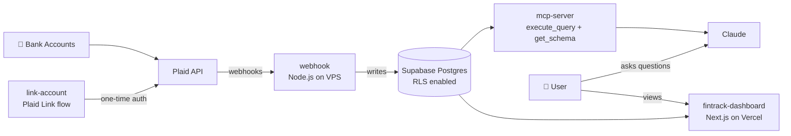

# AI Finance Tracker

A personal finance system that pulls real bank data through Plaid, stores it in Supabase, and exposes it to Claude as a first-class query interface via the Model Context Protocol (MCP). Ask Claude "how much did I spend on coffee last month?" and it runs SQL against your own transaction history.

**Live dashboard:** [fintrack-dashboard-gilt.vercel.app](https://fintrack-dashboard-gilt.vercel.app)

---

## What this is

Most finance apps show you a dashboard and call it a day. This one treats Claude as the interface. The dashboard is there when you want to *look* at your money; Claude is there when you want to *ask questions of* your money.

The system handles the full pipeline end-to-end:

- Connects to your real bank accounts via Plaid
- Ingests transactions through a webhook receiver running on a VPS
- Stores everything in a Supabase Postgres database with RLS enabled
- Exposes `execute_query` and `get_schema` tools to Claude through a custom MCP server
- Renders a Next.js dashboard hosted on Vercel

---

## Architecture



**The flow:** bank accounts get linked once through Plaid Link, Plaid pushes transaction updates to the webhook, the webhook writes them to Supabase, and from there the data is available both to Claude (via MCP) and to the dashboard (via direct DB queries).

---

## Tech stack

| Layer | Tech |
|---|---|
| Frontend | Next.js, TypeScript, deployed on Vercel |
| Backend services | Node.js (webhook + MCP server), TypeScript |
| Database | Supabase (Postgres), RLS enabled on all tables |
| Bank integration | Plaid (sandbox + production) |
| AI interface | Model Context Protocol (MCP) server, consumed by Claude |
| Infra | DigitalOcean VPS for the webhook, Vercel for the dashboard |

---

## Repository layout

```
ai-finance-tracker/
├── .planning/                              # design notes and planning docs
├── link-account/                           # one-time Plaid Link flow (get access tokens)
├── webhook/                                # Plaid webhook receiver, runs on VPS
├── mcp-server/                             # MCP server exposing DB to Claude
├── fintrack-dashboard/                     # Next.js dashboard (Vercel)
├── supabase-migration.sql                  # schema: institutions, accounts, transactions, sync_log
├── SETUP-GUIDE.md                          # Supabase setup walkthrough
├── BEST_PRACTICES.md                       # conventions and patterns
└── financial-assistant-project-plan.md     # project plan
```

---

## Database schema

Four tables, all RLS-enabled:

- **`institutions`** — connected banks (Chase, Schwab, etc.)
- **`accounts`** — individual accounts within each institution (checking, savings, credit)
- **`transactions`** — every transaction, keyed to an account
- **`sync_log`** — audit trail of webhook syncs, for debugging and idempotency

Full schema lives in [`supabase-migration.sql`](./supabase-migration.sql).

---

## Getting started

Each service runs independently. Follow them in this order the first time.

### Prerequisites

- Node.js 20+
- A Supabase project ([setup guide](./SETUP-GUIDE.md))
- Plaid developer account (sandbox keys work for local dev)
- A VPS for the webhook (DigitalOcean, Fly, Railway, whatever)

### 1. Set up Supabase

Follow [`SETUP-GUIDE.md`](./SETUP-GUIDE.md) to create the project and run the migration. At the end you should have a `.env` with:

```env
SUPABASE_URL=https://your-project-id.supabase.co
SUPABASE_SERVICE_ROLE_KEY=your-service-role-key
PLAID_CLIENT_ID=your-client-id
PLAID_SECRET=your-secret
PLAID_ENV=sandbox
```

### 2. Link your bank accounts (`link-account/`)

One-time flow that uses Plaid Link to authenticate with your bank and store the access token. Run this locally — no need to deploy it.

```bash
cd link-account
npm install
npm run dev
```

Open the URL it prints, connect an account, and the token gets saved to Supabase.

### 3. Deploy the webhook receiver (`webhook/`)

This needs a public URL so Plaid can POST to it. Deploy to your VPS and register the URL in your Plaid dashboard.

```bash
cd webhook
npm install
npm run start
```

Point Plaid's webhook URL at `https://your-vps-domain.com/webhook`.

### 4. Run the MCP server (`mcp-server/`)

The MCP server is what lets Claude query your data. It runs locally and is consumed by Claude via a custom connector.

```bash
cd mcp-server
npm install
npm run start
```

Add it as a custom connector in Claude's settings and you can start asking questions.

### 5. Deploy the dashboard (`fintrack-dashboard/`)

```bash
cd fintrack-dashboard
npm install
npm run dev            # local
vercel deploy          # production
```

---

## Using it with Claude

Once the MCP server is connected, Claude has access to two tools: `execute_query` (read-only SQL against the finance DB) and `get_schema` (returns table/column metadata). Example prompts that work well:

- *"How much did I spend on groceries in the last 90 days, grouped by month?"*
- *"What's my average weekly spend on restaurants this year vs last year?"*
- *"Show me every transaction over $500 from the last 30 days."*
- *"Which merchant do I spend the most at on credit cards?"*

Claude writes the SQL, runs it via MCP, and returns the answer. No manual querying required.

---

## Why I built this

I wanted a finance tracker where the primary interface was a conversation, not a dashboard. Existing tools (Mint, Copilot, Monarch) are great at visualizing, but terrible at answering specific, ad-hoc questions. Something like *"did I spend more on gas this quarter than last?"* shouldn't require me to click through five filters.

Building it also gave me a reason to go deep on:

- **MCP server design** — what tools to expose, how to keep the surface minimal and safe
- **Plaid webhooks** — signature verification, idempotency, handling out-of-order events
- **Supabase RLS** — getting the service_role boundary right between public and internal services
- **Multi-service architecture** — four Node services, one Postgres, one frontend, all coordinated

---

## License

MIT
